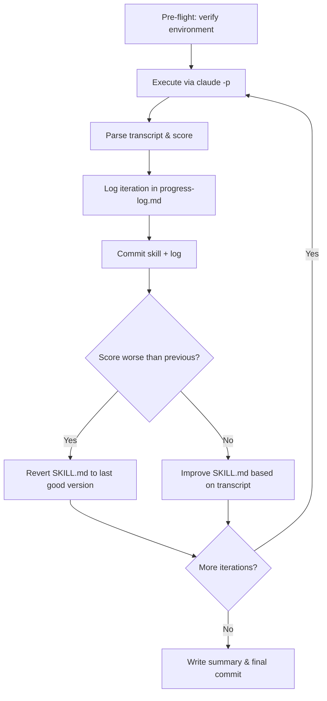

# Skill Optimizer

Run a skill repeatedly, measure performance, refine, commit. Each iteration is diffable.

## Inputs

Collect before starting:

1. **Target skill path** — absolute path to SKILL.md (must be in a git repo)
2. **Working directory** — where `claude -p` executes
3. **Target function** — the prompt (phrased as a real user would)
4. **Evaluation criteria** — what "better" means (default: fewer tool calls)
5. **N** — iterations (default: 5)

## The Loop



### Pre-flight

Verify the `claude -p` environment can run the target function. Read the skill, identify dependencies (MCP servers, running services, DB access), and run a minimal feasibility test before entering the loop.

If it fails, fix the environment first. Log prerequisites in `progress-log.md` under `environment_notes`.

### Step 1: Execute

Run the target function in a fresh session. **The prompt must read as a normal user request — no mention of optimization, scoring, or testing.**

```bash
claude -p "<target_function>" \
  --output-format json \
  --permission-mode bypassPermissions \
  --max-budget-usd <budget> \
  > /tmp/skill-optimizer-result-<iteration>.json \
  2>/dev/null
```

#### Loading the target skill

How you load the target skill depends on what it is:

- **Plugin skill** (has `.claude-plugin/plugin.json`): Use `--plugin-dir <path-to-plugin-root>`. This makes the skill available for activation and resolves `${CLAUDE_PLUGIN_ROOT}` in the skill body. The working directory can be anything.

  ```bash
  claude -p "..." --plugin-dir /path/to/my-plugin
  ```

- **Standalone skill file** (just a SKILL.md, not in a plugin): Use `--add-dir <directory-containing-skill>`. This adds the skill's directory to Claude's context but does NOT resolve `${CLAUDE_PLUGIN_ROOT}`.

  ```bash
  claude -p "..." --add-dir /path/to/skill-directory
  ```

- **Already-installed plugin**: No extra flags needed — installed plugins are loaded automatically.

Other notes:
- **Do NOT use `--bare`** — it strips skills, subagents, MCP servers, hooks, and plugins, producing unrepresentative results.
- The JSON result contains `session_id`, `cost`, `num_turns`, `duration_ms` — but **not** the full transcript.

### Step 2: Evaluate

#### Transcript location

Extract `session_id` from the JSON result. The full transcript is at:

```
~/.claude/projects/<sanitized-cwd>/<session_id>.jsonl
```

Sanitized cwd: replace `/` with `-`, strip leading `-`. Example: `/Users/alice/code/myproject` becomes `-Users-alice-code-myproject`.

#### Counting tool calls

Count tool_use blocks across the main session and all subagents using jq:

```bash
# Main session
cat ~/.claude/projects/<sanitized-cwd>/<session_id>.jsonl \
  | jq -r 'select(.type == "assistant") | .message.content[]? | select(.type == "tool_use") | .name' \
  | wc -l

# All subagents (recursive)
find ~/.claude/projects/<sanitized-cwd>/<session_id>/subagents -name "*.jsonl" 2>/dev/null \
  | xargs -I{} sh -c 'cat "{}" | jq -r "select(.type == \"assistant\") | .message.content[]? | select(.type == \"tool_use\") | .name"' \
  | wc -l
```

Sum both counts for the total. Subagent metadata is in sibling `.meta.json` files (`{"agentType": "Explore", "description": "..."}`).

**Do not rely on `agent_progress` entries** in the parent JSONL — those are streamed updates and miss tool calls. Always read each subagent's own `.jsonl`.

**Enhanced transcript analysis:** If the `transcript-reader` plugin is installed (`claude plugin install transcript-reader@ivors-claude-code-marketplace`), you can get a comprehensive single-command analysis including tool counts, sub-agent breakdowns, token usage, and meandering detection. See the plugin README for details.

#### Verify Skill activation

Check whether the test session actually invoked the Skill tool to load the target skill. This is critical — if the Skill tool was never called, the skill body was invisible and the test is meaningless.

```bash
cat ~/.claude/projects/<sanitized-cwd>/<session_id>.jsonl \
  | jq -r 'select(.type == "assistant") | .message.content[]? | select(.type == "tool_use" and .name == "Skill") | .input' \
  2>/dev/null
```

If empty: the skill was never loaded. The `description` field needs to be more compelling (see "The Description Trick" below).

#### Analysis

- Did the skill succeed?
- **Was the Skill tool invoked?** If not, the skill body was never loaded — fix the description first.
- Where did it waste effort (retries, wrong approaches, unnecessary exploration)?
- What did it re-discover at runtime that the skill could have provided directly?
- Compare to previous iterations — did the last change help or hurt?

### Step 3: Log & Commit

Log results and commit using the format in `${CLAUDE_PLUGIN_ROOT}/references/progress-log-format.md`.

### Step 4: Improve the Skill

Analyze the transcript and progress history. Strategies:

#### The Description Trick (check this FIRST)

The skill's `description` field in YAML frontmatter is the **only thing Claude sees by default**. The full SKILL.md body is invisible until the Skill tool is invoked. If the test session never called the Skill tool, all rules and instructions inside the body were ignored.

Fix: rewrite the description to **compel activation**. Change passive descriptions:
```
description: Use when the user asks about X...
```
To urgent, action-oriented descriptions that explain WHY activation is required:
```
description: MUST activate before doing X. Without this skill, Y will fail because Z. Provides scripts and decision trees for the correct approach.
```

The pattern that works: **"MUST activate" + explain the consequence of not activating + name what the skill provides.**

#### Extract logic to standalone scripts

Instead of embedding code snippets in the skill body (which Claude may ignore or rewrite), put complex logic in standalone scripts under a `scripts/` directory and reference them via `${CLAUDE_PLUGIN_ROOT}/scripts/`:

```bash
python3 ${CLAUDE_PLUGIN_ROOT}/scripts/my_script.py <args>
```

Benefits:
- Claude runs the provided script rather than writing its own (fewer tool calls)
- Scripts are testable outside of Claude
- No risk of Claude miscopying inline snippets
- Requires the skill to be a plugin (with `.claude-plugin/plugin.json`)

#### Other strategies

- **Pre-document runtime discoveries** — schemas, paths, common values the agent kept looking up
- **Add decision trees** — eliminate trial-and-error exploration
- **Provide exact commands/snippets** — not descriptions of what to do
- **Add "do not" rules** — where the agent consistently wastes effort
- **Restructure freely** — reorder, split, merge sections if the current structure isn't working
- **Research** — search for skill-writing patterns and best practices online

#### Anti-regression

If the score is **worse** than the previous iteration: log it fully (the data is valuable), then revert SKILL.md to the last good version via `git checkout <sha> -- <path>`. Never repeat a strategy that already failed.

## Notes

- Execution happens in the working directory; skill edits and commits happen in the skill's repo — these are different locations.
- If `claude -p` crashes entirely, log as a failed iteration and still attempt an improvement.
